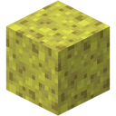

# Essential Sponge
Welcome to the *Essential Sponge* Minecraft mod.

This mod provides new behaviors of sponges. Things you never knew you needed, but that are absolutely essential, as I'm sure you will agree.

1) Sponges can absorb rain water, and become wet sponges after some time spent under the rain.
2) Wet sponges can be crafted by combining a dry sponge and a water bucket.
3) Wet sponges can be dried using dripstones (similar to how mud can be turned into clay this way)

#

           
